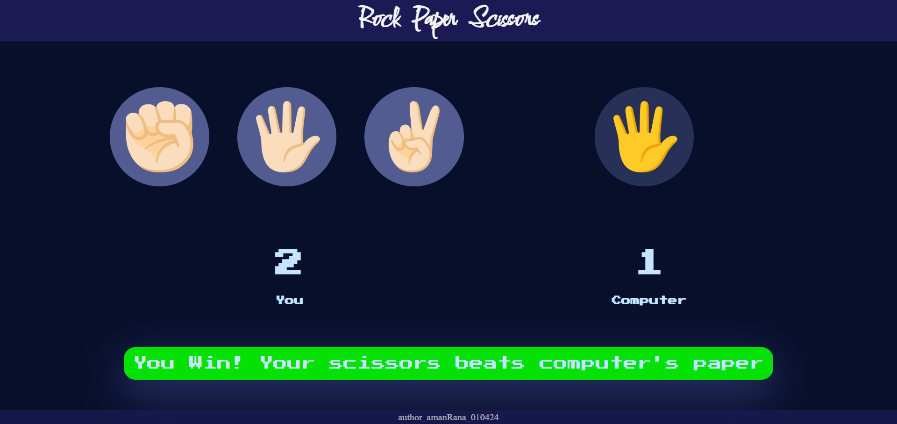

# Rock, Paper, Scissors 🪨📄✂️

This is the **easiest game I've ever made** with the **most basic logic**, but let's face it—it's a classic that **everyone has played at least once** in their life. So, I just had to made it!

 

## Why This Project? 🤔
Sometimes, the simplest ideas are the most fun to work on. Building this game was a fun reminder that coding doesn't always have to be complicated—it can be just as enjoyable when it's straightforward!

 

## Try it Live 🌐 
You can play the game directly on GitHub Pages:  
[Rock-Paper-Scissors](https://amanranahere.github.io/Rock-Paper-and-Scissors/)

 

## Screenshot 🚀

 
